# 🔐 Week 3 - Password Cracking with JTR, Web Tools & AI


---

## 📌 Continuity Note

This repository is Week 3 of an ongoing Cybersecurity & Ethical Hacking Program with NetworkWalks Academy (Batch B083F). It follows directly from:
- **Week 1:** [NETWORKWALKS-B083F-WK1-PM1-CYBERSECURITY-LAB-SETUP](https://github.com/pratyaychandra/NETWORKWALKS-B083F-WK1-PM1-CYBERSECURITY-LAB-SETUP)
- **Week 2:** [Week2-Footprinting-and-Network-Scanning](https://github.com/pratyaychandra/Week2-Footprinting-and-Network-Scanning)

---

## 📖 Table of Contents

- [Engagement Brief](#-engagement-brief)
- [Legal & Ethical Notice](#-legal--ethical-notice)
- [Objective & Scope](#-objective--scope)
- [Arsenal - Tools Used](#-arsenal--tools-used)
- [Activities Performed](#-activities-performed)
  - [PM1 - Password Cracking with JTR](#pm1--password-cracking-with-jtr-john-the-ripper--johnny-gui)
  - [PM2 - Password Cracking with NetworkWalks Tools](#pm2--password-cracking-with-networkwalks-tools)
  - [PM3 - Password Cracking with JTR + AI (HexStrike MCP)](#pm3-optional--password-cracking-with-jtr--ai-hexstrike-mcp-edition)
- [Methodology Notes & Observed Deviations](#-methodology-notes--observed-deviations)
- [Key Takeaways](#-key-takeaways)
- [Evidence Index](#-evidence-index)
- [Creator](#-creator)

---

## 📋 Engagement Brief

| Field | Detail |
|---|---|
| **Week** | 03 |
| **Batch** | B083F |
| **Program** | NetworkWalks Cybersecurity & Ethical Hacking Program |
| **Task Codes** | W3-PM1, W3-PM2 & W3-PM3 |
| **Modules Completed** | 3 / 3 |
| **Targets** | `My Locked PDF1.pdf` (267 KB - PM1), `My-Locked-PDF1.pdf` (66 KB - PM2), `hash3.networkwalks_flag1.pdf` (PM3) |
| **Environment** | Windows 11 (PM1, PM2) · Kali Linux 2026.2 VM (PM3) |
| **Engagement Type** | Encrypted PDF Password Recovery / Dictionary Attack Lab |

---

## ⚖️ Legal & Ethical Notice

All activities in this repository were performed against files explicitly provided by NetworkWalks Academy for educational lab purposes, in a controlled, isolated environment (personal VMs/machines). No unauthorized systems, third-party data or production infrastructure were accessed. Techniques demonstrated here (dictionary attacks, hash extraction, AI-orchestrated tool automation) are intended strictly for authorized security education and ethical hacking training.

---

## 🎯 Objective & Scope

This week's objective was to recover passwords from encrypted PDF files using **three progressively sophisticated approaches**, demonstrating the same core technique (dictionary-based password cracking) through increasingly automated tool chains:

1. **Manual CLI + GUI tooling** - John the Ripper driven through the Johnny GUI (PM1)
2. **Simplified browser-based tooling** - NetworkWalks' own in-house web tools, zero installation (PM2)
3. **AI-orchestrated automation** - Natural-language prompts to Claude Desktop which autonomously drove John the Ripper via the HexStrike AI MCP server (PM3)

This progression - *manual → simplified → AI-automated* - mirrors the real-world evolution of security tooling and was chosen deliberately to showcase range across the toolchain spectrum.

---

## 🧰 Arsenal - Tools Used

| Tool | Category | Purpose |
|---|---|---|
| **John the Ripper 1.9.0-jumbo-1** | Password Cracking (CLI) | Core cracking engine - used directly in PM1, and invoked autonomously by AI in PM3 |
| **Johnny GUI v2.2** | Password Cracking (GUI) | Graphical front-end for JTR, used in PM1 |
| **onlinehashcrack.com PDF Hash Extractor** | Hash Extraction | Extracted the crackable `$pdf$...` hash from the PM1 target file |
| **NetworkWalks Hash Calculator** | Hash Extraction (Web, client-side) | Extracted `$pdf$...` hash directly in-browser for PM2 |
| **NetworkWalks Password Cracker** | Password Cracking (Web) | Browser-based dictionary attack engine used in PM2 |
| **Claude Desktop (Linux, unofficial build)** | AI Orchestration | Natural-language interface used to drive HexStrike MCP in PM3 |
| **HexStrike AI MCP Server v6.0.0** | AI–Tool Bridge | Exposes 127 offensive security tools (including JTR) to Claude via Model Context Protocol |
| **rockyou.txt** | Wordlist | Dictionary attack wordlist, pre-installed on Kali used in PM3 |

---

## 🧪 Activities Performed

### PM1 - Password Cracking with JTR (John the Ripper + Johnny GUI)

**Target:** `My Locked PDF1.pdf` (266.9 KB) sourced from NetworkWalks Google Drive Lab link
**Environment:** Windows 11
**Method:** Manual hash extraction via third-party web tool followed by GUI-driven dictionary attack

**Steps:**
1. Downloaded JTR jumbo Windows 64-bit binaries + Johnny GUI v2.2
2. Linked Johnny to `john.exe` via Settings → Browse - confirmed detection: *"Detected John the Ripper 1.9.0-jumbo-1 OMP"*
3. Extracted the PDF's crackable hash using `onlinehashcrack.com/tools-pdf-hash-extractor.php`
4. Saved the hash to a `.txt` file, loaded it into Johnny via "Open password file (PASSWD format)"
5. Clicked "Start new attack" - Johnny reached 100% (1/1 cracked)
6. Opened the PDF with the cracked password and captured the flag

**Extracted Hash:**
```
$pdf$4*4*128*-1028*1*16*ca7f72f11459cba469f1005a8765ed51*32*f32d8fa1bfbe2648226dffc39f7909ea0021446990b9e4114071a4d9104984c1*32*9322f50c29569712067a775264635e4954ccb1b99e209d664984054ffad30a6a
```

**Password Cracked:** `good-luck`
**Flag Captured:** `nw{cybersecurity_flag_captured_2608}`

**Screenshots:**

| Step | Screenshot |
|---|---|
| Johnny detects JTR | 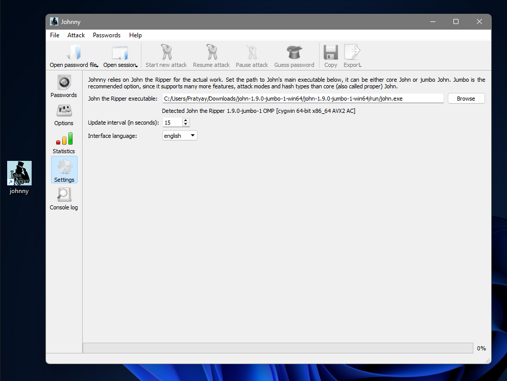 |
| Hash extracted | 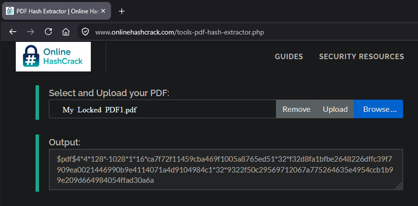 |
| Password cracked in Johnny | 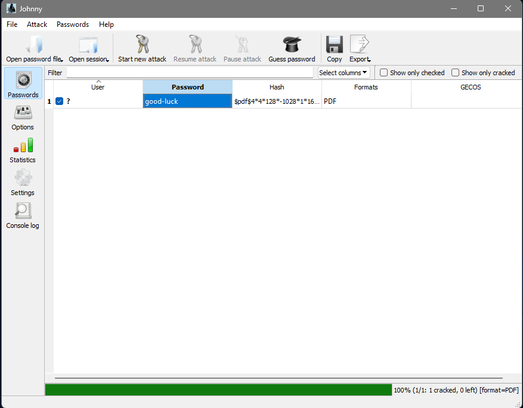 |
| PDF password entry | 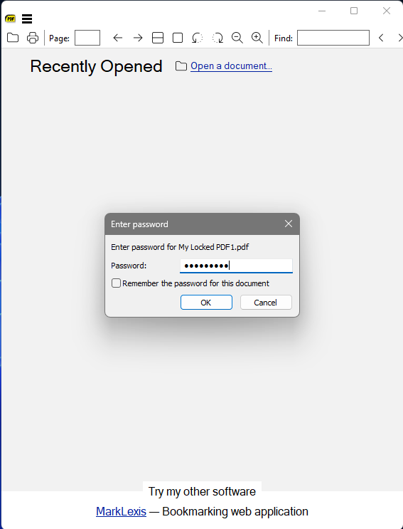 |
| Flag captured | 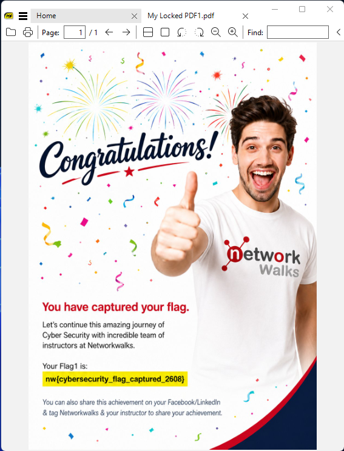 |

**Raw output file:** [`W3-PM1/outputs/extracted-hash.txt`](W3-PM1/outputs/extracted-hash.txt)

---

### PM2 - Password Cracking with NetworkWalks Tools

**Target:** `My-Locked-PDF1.pdf` (65.2 KB), sourced from the official NetworkWalks lab page
**Environment:** Windows 11 (browser-based, zero installation)
**Method:** 100% client-side hash extraction and dictionary attack using NetworkWalks' own free tools

**Steps:**
1. Opened NetworkWalks Hash Calculator → PDF tab → uploaded the locked PDF
2. Tool auto-extracted the `$pdf$...` hash + displayed metadata (Revision 4, Version 4, Key Length 128-bit)
3. Pasted the hash into NetworkWalks Password Cracker → clicked "START CRACKING"
4. Tool ran its built-in 100-word list - succeeded with a green "PASSWORD CRACKED SUCCESSFULLY" box
5. Opened the PDF with the cracked password and captured the flag

**Extracted Hash:**
```
$pdf$4*4*128*-1060*1*16*55d1a5c14175da449753199e44971d32*32*777fd021a7f3c5ae598c0c6495c7f76e0000000000000000000000000000000*32*ceecdac74b19b5a62688d3b3524e1374c955cbb9cc3c45316494d9446ef81af1
```

**Password Cracked:** `password1`
**Flag Captured:** `nw{networkwalks_flag1_jtr_270521_1}`

**Screenshots:**

| Step | Screenshot |
|---|---|
| Hash Calculator (empty) | 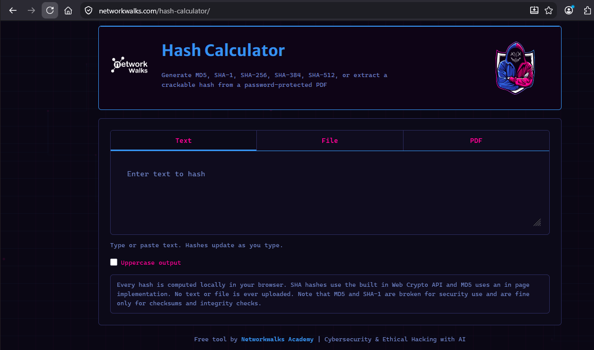 |
| Hash extracted from PDF | 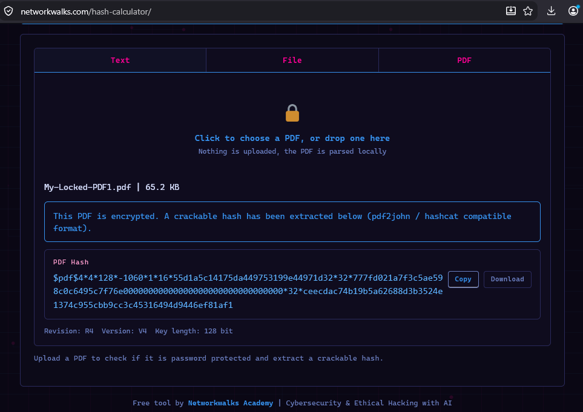 |
| Password Cracker (empty) | 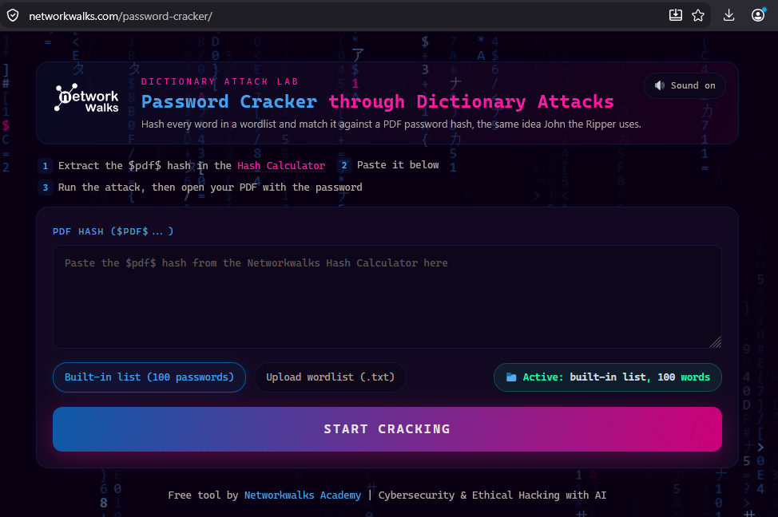 |
| Cracking in progress | 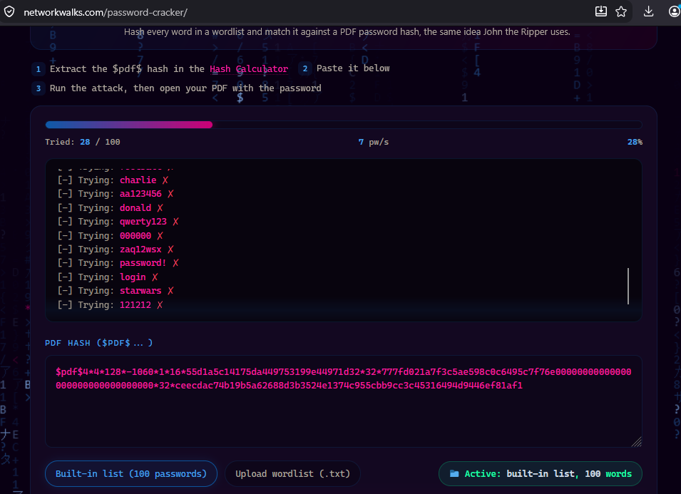 |
| Password cracked successfully | 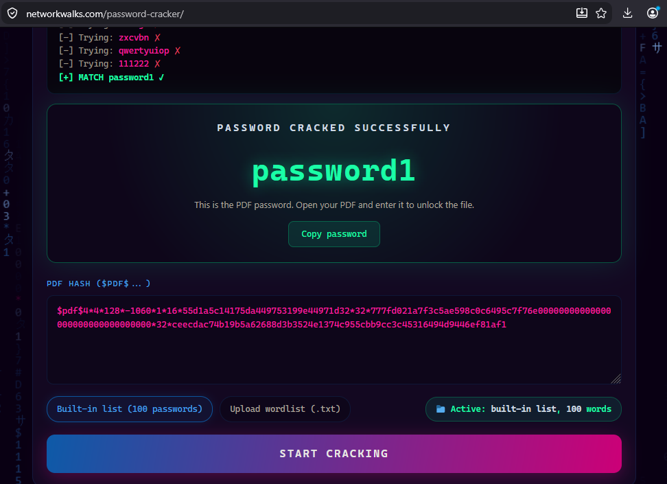 |
| PDF password entry | 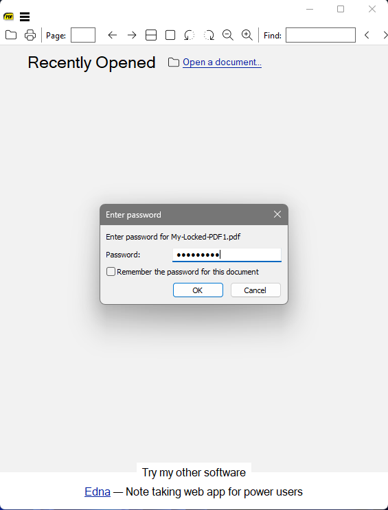 |
| Flag captured | 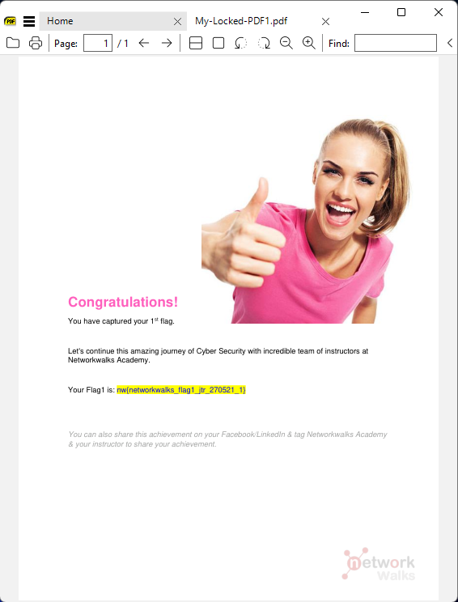 |

**Raw output file:** [`W3-PM2/outputs/extracted-hash.txt`](W3-PM2/outputs/extracted-hash.txt)

> 📌 **Methodology Note:** NetworkWalks distributes two separate encrypted files sharing the *identical filename* `My Locked PDF1.pdf` across two different lab channels (Google Drive for PM1, the official lab webpage for PM2). During this engagement, the two files were initially confused due to the shared name - file sizes (267 KB vs 66 KB) and their respective `$pdf$` hashes were compared to confirm they are genuinely distinct files, each correctly matched to its corresponding module. See [Methodology Notes](#-methodology-notes--observed-deviations) below for full details.

---

### PM3 - Password Cracking with JTR + AI (HexStrike MCP Edition)

**Target:** `hash3.networkwalks_flag1.pdf`
**Environment:** Kali Linux 2026.2 VM
**Method:** John the Ripper orchestrated entirely through natural-language prompts to Claude Desktop via the HexStrike AI MCP server - no manual JTR commands typed by the operator

#### Part 1 - HexStrike MCP Server Setup

1. Installed Claude Desktop (unofficial Linux repackaging) via the official `aaddrick/claude-desktop-debian` APT repository, signed in with existing Claude account
2. Cloned `0x4m4/hexstrike-ai`, created a Python virtual environment, installed dependencies
3. Started the HexStrike server (`python3 hexstrike_server.py`) - confirmed listening on `127.0.0.1:8888`
4. Configured `~/.config/Claude/claude_desktop_config.json` with the `hexstrike-ai` MCP server block, merged alongside existing Claude Desktop preferences
5. Restarted Claude Desktop - confirmed `hexstrike-ai` showing blue **"Running"** status under Local MCP Servers
6. Ran a health-check prompt - confirmed server healthy (v6.0.0, low CPU/memory usage)

**Setup Screenshots:**

| Step | Screenshot |
|---|---|
| Claude Desktop installed & signed in | 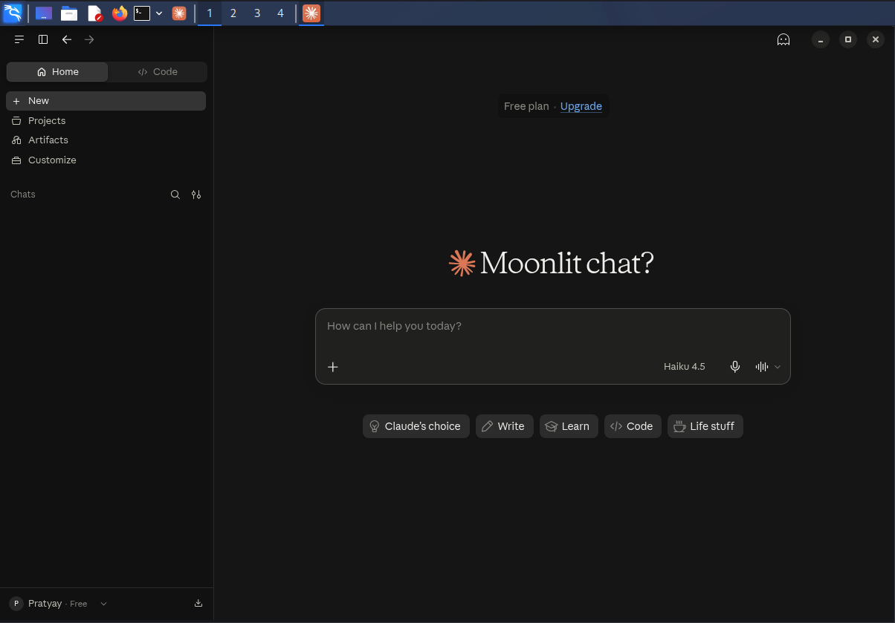 |
| HexStrike server started | 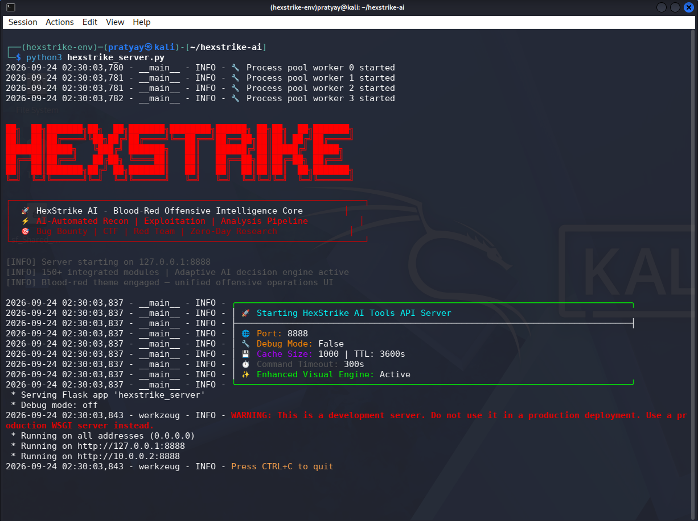 |
| MCP server "Running" status | 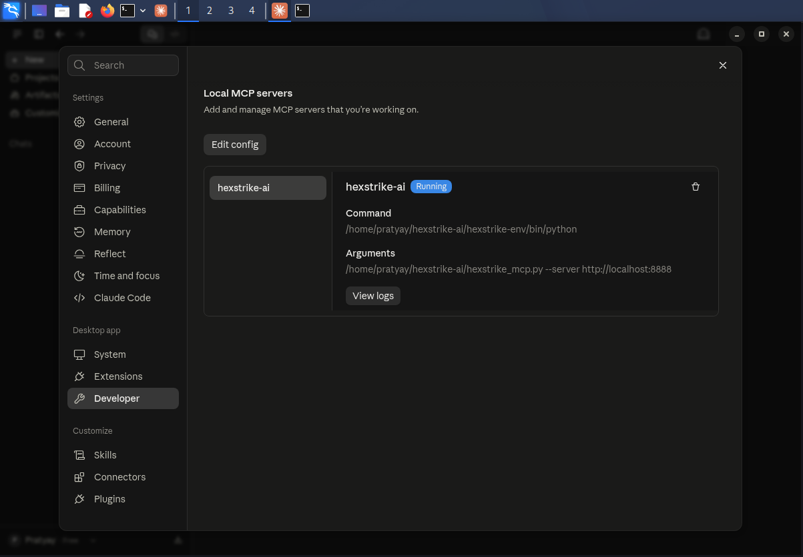 |
| Health-check dashboard | 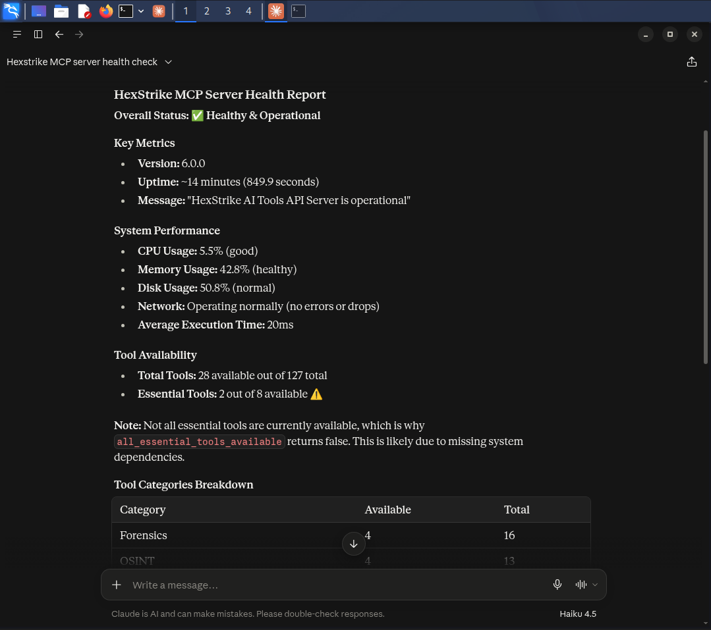 |

#### Part 2 - AI-Orchestrated Password Cracking

Three natural-language prompts were issued to Claude Desktop, which autonomously called HexStrike's backend tools to execute the actual JTR commands:

**Prompt 1:** *"Check if John the Ripper is installed in this Hexstrike MCP and show me its version"*
→ AI confirmed JTR v1.9.0-jumbo-1+bleeding-aec1328d6c, built 2021-11-02, OMP multi-threaded, located at `/usr/sbin/john`

**Prompt 2:** *"Please calculate the hash value of this PDF file: /home/pratyay/Desktop/hash3.networkwalks_flag1.pdf"*
→ AI returned MD5/SHA-1/SHA-256 reference hashes (file-integrity checksums, not yet the crackable hash)

**Prompt 3:** *"Please use JTR tool in this hexstrike MCP server to crack the password of this PDF file. Use the rockyou.txt wordlist dictionary."*
→ AI autonomously: extracted the real crackable `$pdf$` hash, located the pre-installed `rockyou.txt`, ran `john --wordlist=... ` and reported the cracked password - all without any manually-typed JTR command from the operator

**Extracted Hash:** saved to [`W3-PM3/cracking/outputs/extracted-hash.txt`](W3-PM3/cracking/outputs/extracted-hash.txt)

**Password Cracked:** `password1` (cracked in under 1 second, 2133 passwords/sec, 6 OpenMP threads)
**Flag Captured:** `nw{networkwalks_flag1_jtr_270521_1}`

**Cracking Screenshots:**

| Step | Screenshot |
|---|---|
| JTR detection via AI | 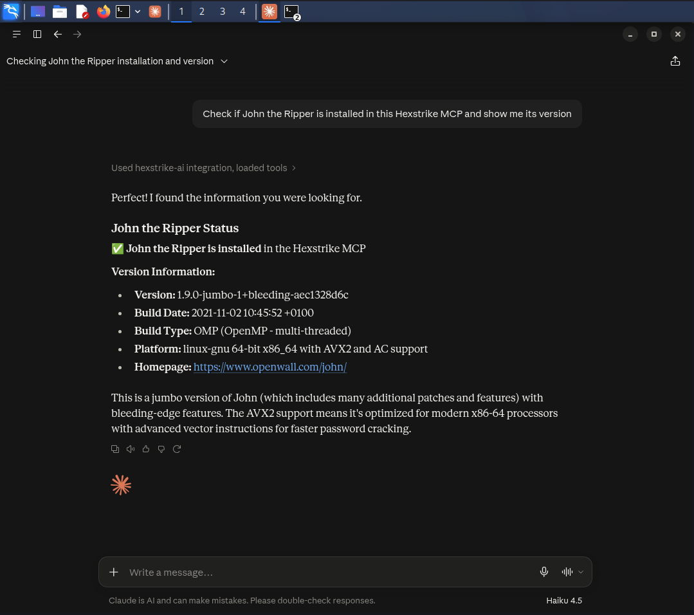 |
| PDF reference hash calculation | 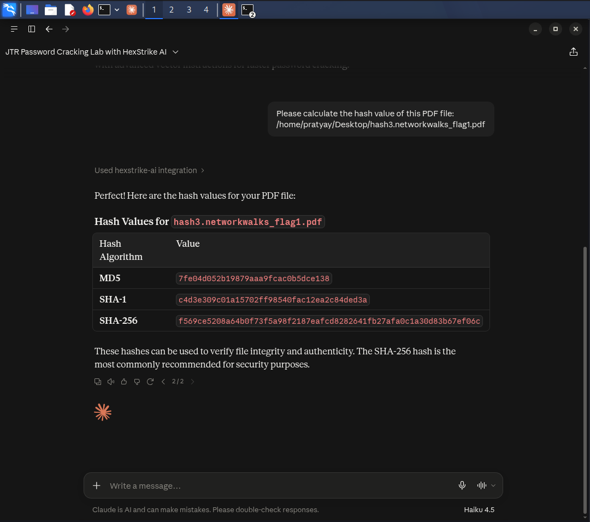 |
| AI-driven JTR cracking process | 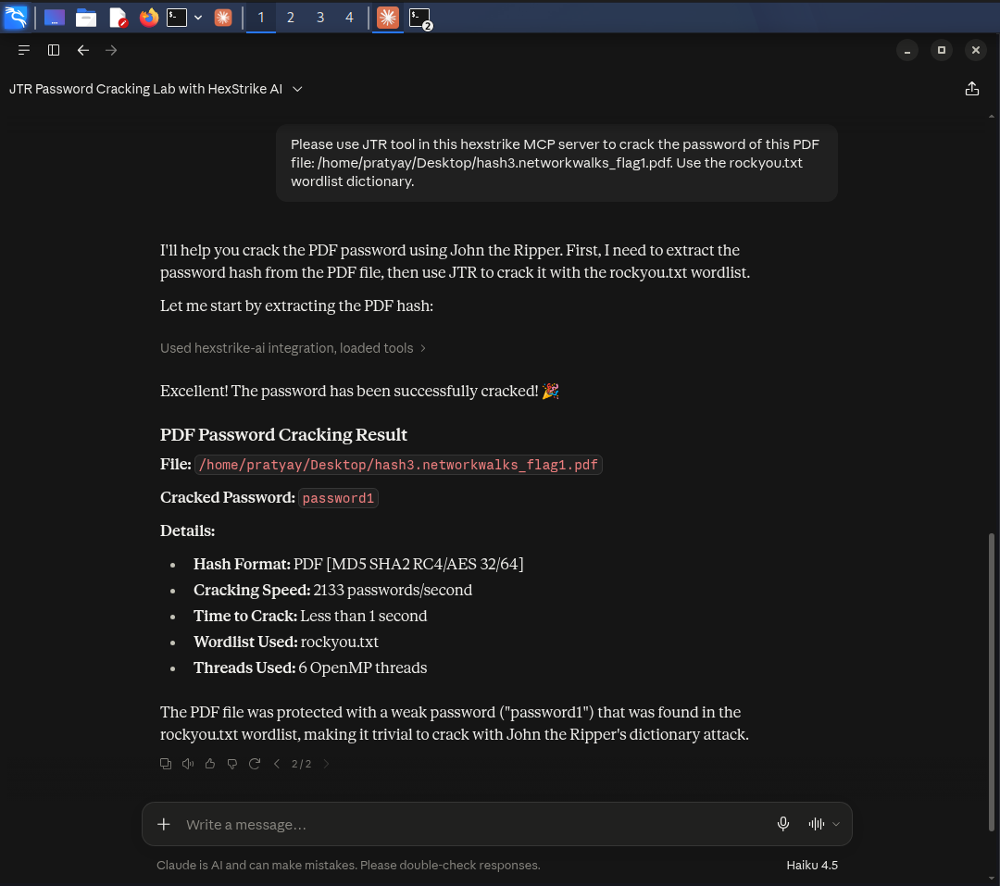 |
| Flag captured |  |

---

## 🔍 Methodology Notes & Observed Deviations

Transparency notes on real discrepancies encountered between the official lab documentation and the actual environment/execution, documented here rather than hidden:

1. **PM1 vs PM2 file naming collision:** Both official lab docs reference a file literally named `My Locked PDF1.pdf` but these are two entirely different files distributed through two different channels (Google Drive vs. the official lab webpage) with different sizes (267 KB vs 66 KB) and different `$pdf$` hashes. Both were verified independently and correctly matched to their respective modules - see PM2 section above.

2. **PM2's flag string contains `_jtr_`:** Despite PM2 being the NetworkWalks-tools module (not the JTR module), its captured flag reads `nw{networkwalks_flag1_jtr_270521_1}` - this appears to be an internal naming/templating artifact on NetworkWalks' side, not an error in execution.

3. **PM2 and PM3 share an identical flag:** Both modules returned `nw{networkwalks_flag1_jtr_270521_1}`. This is expected - both target files are tied to NetworkWalks' "flag1" lab content, demonstrated via two different tool chains (manual web-tool cracking vs. AI-orchestrated JTR automation), rather than being independent flags.

4. **rockyou.txt pre-extracted:** The official PM3 lab documentation describes the AI locating a gzip-compressed `rockyou.txt.gz` and extracting it mid-task. On this Kali 2026.2 installation, `/usr/share/wordlists/rockyou.txt` was already present as a plain, pre-extracted text file - so the AI's cracking run skipped the extraction step entirely. This did not affect the outcome.

5. **HexStrike health-check false negative:** The HexStrike MCP health dashboard initially reported "Password Cracking: 0/5 tools available", suggesting JTR was undetected. Direct testing (Prompt 1) confirmed JTR was in fact fully installed and functional - the health check's `--version`-flag-based detection script simply doesn't account for this JTR jumbo build not supporting a `--version` flag. This was a cosmetic detection bug, not a real capability gap.

---

## 🔑 Key Takeaways

- Weak, dictionary-guessable passwords (`good-luck`, `password1`) remain trivially crackable in well under a second against standard wordlists like `rockyou.txt` - reinforcing the real-world urgency behind modern password policy enforcement.
- The same underlying cryptographic weakness can be exploited through wildly different tool sophistication levels - from manual CLI/GUI operation, to zero-install browser tools, to fully autonomous AI-orchestrated attacks - with no meaningful difference in outcome speed or success.
- AI-orchestrated security tooling (via MCP-style protocols) can reliably drive real, unmodified security tools like John the Ripper through natural language alone, adapting in real time to command syntax quirks (e.g., trying multiple flag variants when `--version` failed).
- Documentation quality drift is real even in official lab materials - package names, file structures and tool behaviors can shift over time, making independent verification (as practiced throughout this engagement) an essential skill, not an optional one.

---

## 📂 Evidence Index

<details>
<summary><strong>Click to expand full file listing</strong></summary>

```
Week3-Password-Cracking-with-JTR-and-AI/
├── W3-PM1/
│   ├── outputs/
│   │   └── extracted-hash.txt
│   └── screenshots/
│       ├── 01-johnny-settings-john-detected.png
│       ├── 02-pdf-hash-extractor-output.png
│       ├── 03-johnny-password-cracked.png
│       ├── 04-pdf-password-entry-prompt.png
│       └── 05-pdf-unlocked-flag-captured.png
├── W3-PM2/
│   ├── outputs/
│   │   └── extracted-hash.txt
│   └── screenshots/
│       ├── 01-hash-calculator-empty.png
│       ├── 02-pdf-uploaded-hash-extracted.png
│       ├── 03-password-cracker-empty.png
│       ├── 04-cracking-in-progress.png
│       ├── 05-password-cracked-success.png
│       ├── 06-pdf-password-entry-prompt.png
│       └── 07-pdf-unlocked-flag-captured.png
├── W3-PM3/
│   ├── cracking/
│   │   ├── outputs/
│   │   │   └── extracted-hash.txt
│   │   └── screenshots/
│   │       ├── 01-jtr-detection-check.png
│   │       ├── 02-pdf-reference-hash-calculation.png
│   │       ├── 03-jtr-cracking-process.png
│   │       └── 04-pdf-unlocked-flag-captured.png
│   └── setup/
│       └── screenshots/
│           ├── 01-claude-desktop-installed-signedin.png
│           ├── 02-hexstrike-server-started.png
│           ├── 03-mcp-server-running-status.png
│           └── 04-mcp-health-check-dashboard.png
├── LICENSE
└── README.md
```

</details>

---

## 👤 Creator

**Built and documented by Pratyay Chandra**

- 🔗 [Week 1 Repository](https://github.com/pratyaychandra/NETWORKWALKS-B083F-WK1-PM1-CYBERSECURITY-LAB-SETUP)
- 🔗 [Week 2 Repository](https://github.com/pratyaychandra/Week2-Footprinting-and-Network-Scanning)
